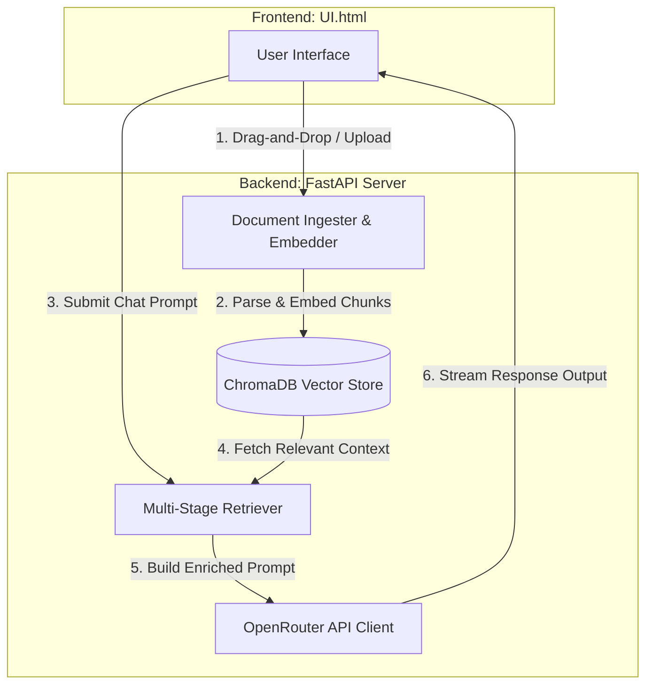

# LemmeSearch — Local RAG & Chat System

**lemmesearch** is a self-hosted Retrieval-Augmented Generation (RAG) system. It combines a local semantic search engine (ChromaDB + Sentence Transformers) with LLM reasoning (via OpenRouter) and an elegant, Claude-style user interface.

---

## 🚀 Key Features

*   **Claude-Inspired User Interface:** A beautiful, responsive frontend with a signature warm-linen light theme and charcoal dark theme. Features sidebar navigation, collapsible controls, and responsive styling.
*   **Local Semantic Search Engine:** Powered by a local **ChromaDB** vector database and HuggingFace **Sentence Transformers** (`intfloat/e5-base-v2` by default). All text embeddings are generated locally on your machine.
*   **Multi-Stage Retrieval Pipeline:**
    *   *Multi-Query Expansion:* Analyzes follow-up prompts and chat history to generate optimized search variations.
    *   *Reciprocal Rank Fusion (RRF):* Merges results from query variations to find the most relevant document chunks.
    *   *Neighbor Window Context Expansion:* Re-stitches sibling chunks surrounding matching nodes to prevent context fragmentation and preserve sentence flow.
*   **OpenRouter Integration:** Access any modern LLM (Claude, GPT, DeepSeek, Kimi, etc.) with Server-Sent Events (SSE) token streaming.
*   **Reasoning Mode & System Personas:** Configure reasoning effort levels (low, medium, high) for reasoning-capable models (e.g., DeepSeek v4, gemma 4 31b, qwen 3.7 etc) and customize the system prompts directly through the UI.
*   **Live Document Ingestion:** Drag-and-drop documents (only text based docs like PDF, TXT, PPT, Word, etc.) and monitor chunking, text parsing (via PyMuPDF), and local embedding creation through a live progress bar.
*   **Markdown-Based Local History:** Chats are automatically saved as clean, readable Markdown files inside the `credential/chat_history/` directory.

---

## ⚙️ How It Works (System Architecture)

The system is split into two primary components: a **FastAPI backend** that handles storage and vector searches, and a **Vanilla HTML/CSS/JS frontend** that delivers the chat experience.



### 1. The Ingestion Pipeline (`backend/parser.py`, `backend/embeddings.py`, `backend/db.py`)
*   **Extraction:** When a document is uploaded, the backend extracts text using PyMuPDF.
*   **Chunking:** The text is divided into manageable chunks using an overlapping character splitter.
*   **Embedding:** Each chunk is converted into a 768-dimensional dense vector using the `intfloat/e5-base-v2` transformer model. Text passages are prefixed with `passage: ` for optimal alignment with the E5 schema.
*   **Indexing:** The vectors are stored along with their metadata (document ID, filename, chunk index, parent text) in a ChromaDB database collection.

### 2. The Multi-Stage Retrieval Pipeline (`backend/retrieval.py`)
When you submit a query in search-enabled mode, the query undergoes several stages:
1.  **Multi-Query Expansion:** If your query is a short follow-up or contains pronouns (like *"tell me more about it"*), the pipeline looks at the conversation history and expands it to include context (e.g., *"Topic of previous turn + tell me more about it"*).
2.  **Vector Search:** The embedder generates vectors for each query variation (prefixed with `query: `). ChromaDB returns candidate lists for all queries.
3.  **Reciprocal Rank Fusion (RRF):** The overlapping candidates from multiple searches are re-ranked using the RRF algorithm to ensure robust and highly relevant retrieval.
4.  **Neighbor Window Expansion:** For each selected chunk, the retriever pulls the immediately preceding and succeeding sibling chunks from the database and merges them back together. This ensures the LLM sees complete paragraphs and contiguous logical concepts.

### 3. Prompt Assembly & LLM Generation (`backend/llm.py`)
*   The system formats a structured RAG prompt presenting the retrieved context alongside your question and conversation history.
*   The payload is sent to the OpenRouter API. If **Reasoning Mode** is turned on, the reasoning effort parameter is sent to the model, and the reasoning tokens are streamed directly to the frontend.

---

## 📂 Project Structure

```
├── backend/
│   ├── config.py          # Setting structures, API configuration, and path setups.
│   ├── db.py              # ChromaDB vector store wrapper and index management.
│   ├── embeddings.py      # Local SentenceTransformers wrapper.
│   ├── llm.py             # Prompt formatting and OpenRouter SSE communication.
│   ├── main.py            # FastAPI entry point.
│   ├── parser.py          # Document parsing (PDF/TXT) and text splitting.
│   ├── prompts.py         # Handles load/save actions for custom system instructions.
│   ├── retrieval.py       # Multi-stage retrieval logic (Query expansion, RRF, Window expansion).
│   └── router.py          # API endpoints (/ingest, /chat, /history, /credentials, etc.).
├── credential/            # Stores configuration data.
│   ├── chat_history/      # Markdown-based conversation history files.
│   ├── models.md          # Active OpenRouter LLM model configuration.
│   ├── openrouter_api_key.md # Encoded OpenRouter API key.
│   └── system_prompts.md  # Persona system prompts editable via UI.
├── UI.html                # Beautiful Claude-style RAG user interface.
├── pyproject.toml         # Project metadata and dependencies.
├── requirements.txt       # Unified Python dependencies list.
├── lemmesearch.py         # Cross-platform Python runner script.
├── lemmesearch.bat        # Windows launch script.
└── README.md              # Documentation (This file).
```

---

## ⚡ How to Setup & Run (All Platforms)

### Prerequisites
*   Python **3.10** or higher.
*   An active **OpenRouter API Key**.

### Running the Application
Using a single command, you can run `lemmesearch` on Windows, macOS, or Linux:

```bash
python lemmesearch.py
```

This Python script automatically:
1.  Creates a virtual environment (`.venv`) if one does not exist.
2.  Performs data/credential migrations if legacy files exist.
3.  Upgrades `pip` and installs required libraries from `requirements.txt`.
4.  Starts the FastAPI backend server on **`http://127.0.0.1:7777`** .

*Note for macOS/Linux users: Make sure Python is in your path. You may need to run `python3 lemmesearch.py` if `python` resolves to Python 2.x on your system.*

Once the server starts, open your web browser and navigate to:
👉 **`http://localhost:7777`**

---

## 🛠️ API Endpoints

*   **`GET /`**: Serves the `UI.html` frontend.
*   **`POST /api/ingest`**: Uploads and chunks documents with real-time SSE progress streaming.
*   **`GET /api/documents`**: Lists all active documents in ChromaDB.
*   **`DELETE /api/documents/{doc_id}`**: Removes a specific document.
*   **`DELETE /api/documents`**: Purges the entire knowledge database.
*   **`POST /api/chat`**: SSE stream endpoint for LLM responses, incorporating retrieved chunks and chat history.
*   **`GET /api/history`** & **`POST /api/history`**: Syncs and retrieves the Markdown-based chat histories.
*   **`GET /api/credentials`** & **`POST /api/credentials`**: Configures API keys, model selections, and custom system prompts.
